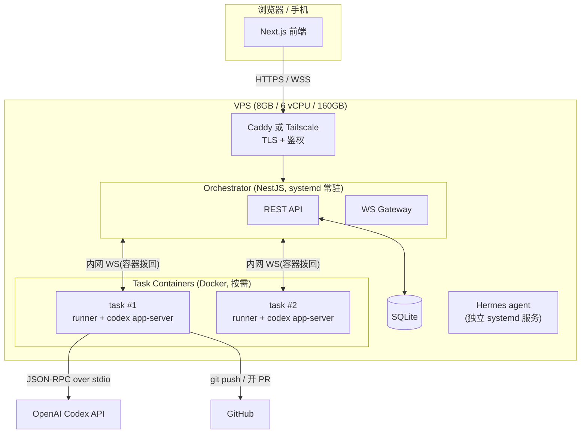
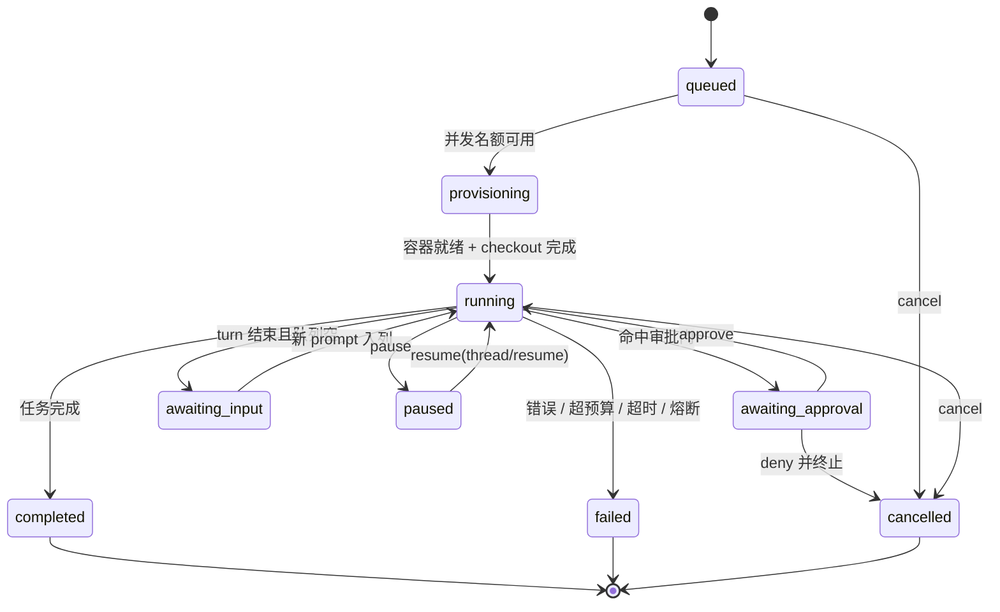
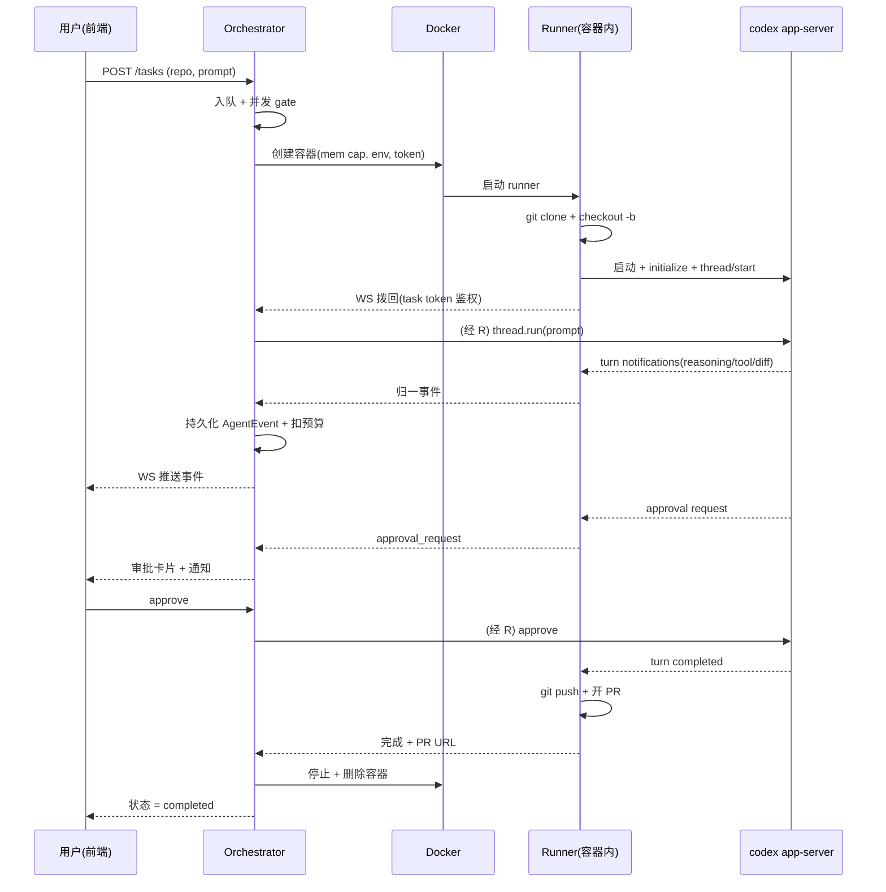

# 云端开发平台 — 前后端设计文档

> 单 VPS(8GB / 6 vCPU / 160GB SSD)上 7×24 运行的 Codex 任务平台。
> 后端 NestJS,前端 Next.js,与 Hermes agent 共存。
> 核心能力:选仓库 → 自动拉分支 → 跑 Codex 做对应 task → 远程下 prompt / 审批 / 通知,交互尽量贴近 Codex 原生体验。

---

## 1. 目标与范围

### 1.1 目标
- 选定一个已注册仓库,创建 task 时自动 `git checkout -b` 出一个分支并在其上跑 Codex。
- 远程下发指令:既能**排队追加** prompt,也能**中途打断/转向**当前 turn。
- **审批流**:Codex 命中危险操作时挂起,推送给用户远程 approve/deny(这同时是"通知 + 远程下令"的合流点)。
- 实时把 Codex 的 reasoning / 工具调用 / 文件 diff 流式渲染到前端,体验贴近 Codex。
- 关键事件(turn 完成、审批门、失败/超时)推送通知(Telegram / ntfy / Bark)。
- 2–3 个 task 并发,与 Hermes agent 共存于同一台 8GB 机器。

### 1.2 非目标(首版不做)
- 多用户 / 团队权限(单用户即可)。
- 多机 / 水平扩展(单 VPS,无分布式原语)。
- 本地大模型托管(Codex 与 Hermes **均接云 API**;本机无 GPU)。
- 复杂 CI/CD 编排(分支 + PR 即止,后续 CI 交给 GitHub)。

### 1.3 环境约束(决定了所有资源决策)
- 8GB RAM / 6 vCPU / 160GB SSD,纯 CPU 无 GPU,共享 KVM(无嵌套虚拟化 → 隔离用 Docker namespace,不用 micro-VM)。
- Codex 与 Hermes 都接云 LLM,本机只跑 agent 框架进程,内存大头是 task 容器的构建峰值。
- 目标并发 2–3,每容器内存硬上限 1.5GB,配 4GB swap 兜底。

---

## 2. 系统架构

三层:**前端(Next.js)** ↔ **编排器(NestJS, 常驻)** ↔ **任务容器(Docker + codex app-server)**。编排器是唯一常驻有状态中枢,容器按需拉起、用完即焚。



**关键边界设计:容器拨回编排器,而不是编排器连进容器。** 创建容器时通过环境变量注入 `ORCHESTRATOR_WS_URL` + `TASK_TOKEN`,容器内的 runner 主动 dial-out 建立 WS。好处:不用为每个容器映射端口,扩容/回收都干净。

---

## 3. 技术栈

| 层 | 选型 |
|----|------|
| 前端 | Next.js (App Router) + TypeScript + Tailwind + TanStack Query + socket.io-client;可选 shadcn/ui |
| 后端 | NestJS + TypeScript;WS 用 `@nestjs/websockets`(socket.io)|
| 持久化 | SQLite(Prisma 或 better-sqlite3;单机一个文件)|
| 容器编排 | Docker + dockerode |
| Agent | `codex app-server`(JSON-RPC),封装在容器内 runner 里 |
| 反代/接入 | Caddy(自动 HTTPS)或 Tailscale(私网,个人首选)|
| 进程托管 | systemd(`Restart=always` + 开机自启)|
| 通知 | Telegram bot / ntfy / Bark(适配器模式)|

---

## 4. 后端设计(NestJS)

### 4.1 模块划分

| Module | 职责 |
|--------|------|
| `ReposModule` | 仓库注册、列表 |
| `TasksModule` | task 生命周期 + 状态机(核心)|
| `RunnerModule` | dockerode 容器编排:创建/监控/回收,注入资源上限与 env |
| `AgentModule` | `CodexEngine` 抽象(port)+ 适配器;与容器 runner 的 WS 控制通道 |
| `EventsModule` + `EventsGateway` | 事件入库 + 归一 + 向前端扇出(WS)|
| `ApprovalsModule` | 审批请求队列与裁决 |
| `PromptsModule` | per-task prompt 队列(排队追加)+ interrupt(转向)|
| `GitModule` | 分支命名、push、调 GitHub API 开 PR |
| `NotificationsModule` | 监听事件 → 推 Telegram/ntfy/Bark |
| `BudgetModule` | 成本/安全护栏:max turns/tokens/timeout、熔断、并发 semaphore |
| `AuthModule` | 单用户 token 鉴权 |
| `HealthModule` | 健康检查 / 基础指标 |

### 4.2 数据模型(SQLite)

```ts
interface Repo {
  id: string;            // uuid
  name: string;
  gitUrl: string;        // https://github.com/owner/repo.git
  defaultBranch: string; // main
  authRef?: string;      // 指向凭证,不存明文 token
  createdAt: Date;
}

type TaskStatus =
  | 'queued' | 'provisioning' | 'running'
  | 'awaiting_approval' | 'awaiting_input'
  | 'paused' | 'completed' | 'failed' | 'cancelled';

interface Task {
  id: string;
  repoId: string;
  title: string;
  initialPrompt: string;
  branchName: string;        // task/<short-id>
  status: TaskStatus;
  model: string;             // gpt-5.3-codex
  mode: 'read-only' | 'auto' | 'full-access';
  codexThreadId?: string;    // 用于 thread/resume
  containerId?: string;
  workspacePath: string;     // /opt/devplatform/workspaces/<id>
  // 预算护栏
  maxTurns: number;
  maxTokens: number;
  deadlineAt?: Date;
  // 运行计量
  turnCount: number;
  tokensUsed: number;
  prUrl?: string;
  error?: string;
  createdAt: Date;
  startedAt?: Date;
  finishedAt?: Date;
}

interface AgentEvent {        // 统一事件日志:流式 + 回放双用
  id: string;
  taskId: string;
  seq: number;                // 单 task 内自增,前端按 seq 断点续传
  type: 'message' | 'reasoning' | 'tool_call' | 'tool_result'
      | 'file_diff' | 'status' | 'token_usage' | 'error';
  payload: unknown;           // JSON
  createdAt: Date;
}

interface ApprovalRequest {
  id: string;
  taskId: string;
  action: string;             // 待执行命令摘要
  raw: unknown;               // app-server 原始 payload
  status: 'pending' | 'approved' | 'denied';
  requestedAt: Date;
  resolvedAt?: Date;
}

interface PromptQueueItem {
  id: string;
  taskId: string;
  text: string;
  enqueuedAt: Date;
  consumedAt?: Date;
}
```

> `AgentEvent` 是整套实时体验的基石:既用于 WS 实时推送,也用于前端重连后 `GET /tasks/:id/events?after=<seq>` 补洞,还能做回放。

### 4.3 任务状态机



### 4.4 REST API

| Method | Path | 说明 |
|--------|------|------|
| POST | `/repos` | 注册仓库 |
| GET | `/repos` | 列表 |
| POST | `/tasks` | 创建 task(自动建分支并拉起容器)|
| GET | `/tasks` | 列表,支持 `?status=` |
| GET | `/tasks/:id` | 详情 |
| GET | `/tasks/:id/events?after=:seq` | 事件回放(WS 断线兜底)|
| POST | `/tasks/:id/prompts` | 追加 prompt(`{ text, mode: 'queue' \| 'steer' }`)|
| POST | `/tasks/:id/interrupt` | 打断当前 turn |
| POST | `/tasks/:id/approvals/:aid` | `{ decision: 'approve' \| 'deny' }` |
| POST | `/tasks/:id/pause` / `/resume` | 暂停/恢复(底层走 thread/resume)|
| POST | `/tasks/:id/cancel` | 取消并回收容器 |
| POST | `/tasks/:id/pr` | push 分支并开 PR |
| GET | `/health` | 健康检查 |

**建议:下行用 WS,上行用 REST。** 即实时事件/审批请求/用量靠 WS 推到前端;用户的 prompt/审批/打断走 REST。这样状态变更有明确的请求-响应、便于鉴权与重试,WS 只管单向流。

### 4.5 实时通道(WebSocket Gateway)

- 前端通道:namespace `/ws`,连接时带 user token 鉴权,`join` 房间 `task:<id>`。
- 服务端 → 前端事件:`event`(AgentEvent)、`status`(TaskStatus 变更)、`approval_request`、`usage`(turns/tokens)、`done`。
- 容器通道:namespace `/internal/runner`,用 `TASK_TOKEN` 鉴权;runner 上报归一事件、接收 `runTurn` / `approve` / `interrupt` 指令。
- 编排器在两条通道间做桥接:`runner 上报 → 入库 AgentEvent → 扣预算 → 扇出到 task:<id> 房间`。

### 4.6 Codex 集成层(可降级的核心抽象)

定义一个 `CodexEngine` port,orchestrator 只依赖它;底层实现可替换——这就是之前说的"薄封装 + 可降级"。

```ts
interface CodexEngine {
  startSession(opts: StartSessionOpts): Promise<{ threadId: string }>;
  resumeSession(threadId: string): Promise<void>;
  runTurn(prompt: PromptInput): AsyncIterable<NormalizedEvent>; // 流式
  respondApproval(approvalId: string, decision: 'approve' | 'deny'): Promise<void>;
  interrupt(): Promise<void>;
  dispose(): Promise<void>;
}
```

两个适配器:

1. **`AppServerCodexEngine`(默认,自控)**:容器内 runner 启动 `codex app-server`,完成 `initialize` 握手后用 `thread/start` / `thread/resume` / turn API 驱动,把 turn notification 归一成 `NormalizedEvent` 经 WS 上报。完全自己掌控,无第三方依赖。
2. **`SandboxAgentCodexEngine`(可选)**:接 `rivet-dev/sandbox-agent`,实现同一 port。它替你解决了 TTY / 权限确认 / 事件归一,但项目停更、单维护者、pre-1.0,**只作为加速器,藏在 port 后面,随时可切回方案 1。**

> 之前评估结论复用:Sandbox Agent SDK 对 **skill 支持较好**(`setSkillsConfig` + github/local/git 来源),对 **hook 基本无原生支持**;hooks 走底层 Codex 的原生 config 透传(放进 workspace,agent 进程自己读),平台不托管。

### 4.7 容器编排(dockerode)

基础镜像:`git` + `node` + `codex` CLI + 我们的 in-container runner。

容器创建关键参数:

```ts
docker.createContainer({
  Image: 'devplatform/codex-runner:latest',
  Env: [
    `ORCHESTRATOR_WS_URL=${internalWsUrl}`,
    `TASK_TOKEN=${taskToken}`,
    `TASK_ID=${task.id}`,
    `REPO_URL=${repo.gitUrl}`,
    `BASE_BRANCH=${repo.defaultBranch}`,
    `BRANCH=${task.branchName}`,
    `MODEL=${task.model}`,
    `MODE=${task.mode}`,
    `OPENAI_API_KEY=${injectedKey}`,   // 随任务注入,容器销毁即弃
    `GIT_TOKEN=${injectedGitToken}`,
  ],
  HostConfig: {
    Memory: 1.5 * 1024 ** 3,           // 1.5GB 硬上限
    NanoCpus: 1.5 * 1e9,               // ~1.5 核
    AutoRemove: true,                  // 用完即焚
    NetworkMode: 'devplatform-net',    // 同一 bridge 网络,便于回连
    Binds: [`${task.workspacePath}:/workspace`],
  },
});
```

in-container runner 流程:`clone → checkout -b → 启动 codex app-server → initialize → thread/start → dial-out 回连 orchestrator WS → 收 runTurn 指令转 JSON-RPC → 归一 turn notification 上报 → 处理 approval → 完成后 git push + 开 PR`。

### 4.8 审批流

`app-server` 发出 approval request → runner 上报 `approval_request` → orchestrator 入库 `ApprovalRequest(pending)` + 推前端 + 发通知 → 用户 `POST /approvals/:aid` → orchestrator 经 runner `respondApproval` → app-server 继续。Codex `mode` 默认 `auto`(危险操作才触发审批),敏感仓库设 `read-only`。

### 4.9 通知

适配器模式:`NotificationChannel` 接口,实现 `TelegramChannel` / `NtfyChannel` / `BarkChannel`。监听 `approval_request` / `task.completed` / `task.failed`。Telegram 用 inline 按钮直接 approve/deny,通知与远程下令一条链路;消息里带 `PUBLIC_BASE_URL/tasks/:id` 跳详情页。

### 4.10 成本与安全护栏(7×24 的底线)

- **预算**:每 turn 结束累加 `turnCount` / `tokensUsed`;超 `maxTurns` / `maxTokens` / `deadlineAt` → 强制 `failed` 并停容器。
- **熔断**:同一 task 连续 N 次 turn 失败 → 熔断该 task,避免烧 token 的死循环。
- **并发 semaphore**:`MAX_CONCURRENT_TASKS=2`(burst 3),超额留 `queued`。
- **构建错峰**:可选一个"重活串行锁",避免 2–3 个容器同时跑 `npm install`/build 把 8GB 撑爆(reasoning 可并发,构建别同时砸)。
- **Hermes 侧**:它自己的 provider 配额由 Hermes 管,不归本平台,但同样建议设上限——两个 agent 都可能跑飞。

> 注意:VPS 是固定月费,真正的变动成本是 **LLM token**(Codex 的 OpenAI 费 + Hermes 的 provider 费),大概率远超机器钱。护栏保护的是 token 账单。

### 4.11 Git / 分支 / PR

- 分支命名:`task/<short-id>`,基于 repo `defaultBranch`。
- 凭证:GitHub token **不进容器明文**——用细粒度/只读 token,或经 git credential helper 临时注入,容器销毁即弃。
- 完成后 runner `git push` 分支,orchestrator 用 GitHub API 开 PR,回填 `prUrl`。

### 4.12 鉴权

单用户 token:登录后下发 token,REST 走 `Authorization` header,WS 连接带 token。配合 Tailscale 时公网零暴露,鉴权可更轻。

---

## 5. 前端设计(Next.js)

### 5.1 路由与页面(App Router)

| 路由 | 说明 |
|------|------|
| `/` | Dashboard:task 卡片网格 + 状态过滤 + 新建入口 + 实时状态徽标 |
| `/tasks/new` | RepoPicker + 标题 + prompt + model/mode/budget |
| `/tasks/[id]` | **核心页**:EventTimeline(Codex 风格)+ StatusBar + ApprovalCard + PromptComposer + 分支/PR 操作 |
| `/repos` | 仓库注册与列表 |
| `/settings` | 通知渠道、默认 model/mode/budget、API key 状态 |

### 5.2 状态管理与数据获取
- REST 用 **TanStack Query**(任务列表/详情/历史事件,带缓存与失效)。
- 实时用 **WS**:收到 `event` append 到本地 timeline;重连时用 `GET /tasks/:id/events?after=<lastSeq>` 补洞,保证不丢事件。

### 5.3 实时渲染(任务详情页核心)
- 订阅 `task:<id>` 房间;`event` → 增量渲染;`status` → 更新徽标;`approval_request` → 弹 ApprovalCard;`usage` → 刷新 UsageMeter。
- EventTimeline 按 `AgentEvent.type` 分派渲染:`reasoning`(可折叠)、`tool_call` / `tool_result`、`file_diff`(语法高亮 + 增删色)、`message`。

### 5.4 组件树

```
AppShell
├── Dashboard
│   └── TaskGrid → TaskCard (StatusBadge, 快速操作)
├── TaskDetail
│   ├── StatusBar (StatusBadge, UsageMeter[turns/tokens])
│   ├── EventTimeline
│   │   └── EventItem → MessageBlock | ReasoningBlock | ToolCallBlock | DiffBlock
│   ├── ApprovalCard (approve / deny)
│   ├── PromptComposer (追加 prompt / interrupt 按钮)
│   └── TaskMeta (分支信息, BranchActions: push / 开 PR)
├── RepoPicker / RepoList
└── SettingsForm
```

### 5.5 关键交互
- **下 prompt**:Composer 区分"排队追加"(默认)与"立即转向"(steer);均 `POST /tasks/:id/prompts`。
- **打断**:运行中显式 interrupt 按钮 → `POST /tasks/:id/interrupt`。
- **审批**:ApprovalCard 内联 approve/deny,移动端也可从 Telegram 通知直接操作。
- **移动端**:页面响应式即可手机用;通知走 Telegram/Bark,点开跳详情。

---

## 6. 端到端流程



---

## 7. 部署(VPS)

### 7.1 目录布局

```
/opt/devplatform/
├── backend/             # NestJS 构建产物 (dist/)
├── frontend/            # Next.js standalone 产物
├── data/app.sqlite      # SQLite
├── workspaces/<taskId>/ # 各 task 的 git 工作区(挂进容器)
├── images/              # 任务基础镜像 Dockerfile
└── .env
```

### 7.2 systemd 服务
- `devplatform-api.service`:`node dist/main.js`,`Restart=always`,`EnvironmentFile=/opt/devplatform/.env`。
- `devplatform-web.service`:Next.js standalone `node server.js`(或 `next start`)。
- `hermes.service`:Hermes 独立托管。
- Docker daemon:系统服务。

### 7.3 反代 / 接入(二选一)
- **Tailscale**(个人首选):VPS 入 tailnet,手机/电脑私网直连,公网零暴露。
- **Caddy**:自动 HTTPS,反代 web / api / ws:

```caddyfile
your.domain {
  handle /api/* { reverse_proxy 127.0.0.1:3001 }
  handle /ws/*  { reverse_proxy 127.0.0.1:3001 }
  handle        { reverse_proxy 127.0.0.1:3000 }
}
```

### 7.4 关键环境变量
```
OPENAI_API_KEY=...
GITHUB_TOKEN=...
PUBLIC_BASE_URL=https://your.domain
AUTH_TOKEN=...
MAX_CONCURRENT_TASKS=2
CONTAINER_MEMORY=1610612736        # 1.5GB
CONTAINER_NANOCPUS=1500000000      # ~1.5 核
TELEGRAM_BOT_TOKEN=...
TELEGRAM_CHAT_ID=...
```

### 7.5 前置准备
- 装 Docker;建 4GB swap(`fallocate` → `mkswap` → `swapon` → 写 `/etc/fstab`);构建基础镜像 `devplatform/codex-runner`;建 docker 网络 `devplatform-net`。

---

## 8. 资源与并发配置(8GB 实账)

内存账(均按云 API、无本地模型):

| 项 | 占用 |
|----|------|
| 系统 + Docker daemon | ~0.7GB |
| Hermes(云 API,常驻 CLI) | ~1GB |
| Orchestrator(NestJS) | ~0.2GB |
| **基线小计** | **~1.9GB** |
| 剩余给 Codex 容器 | **~6GB** |
| 每容器 cap 1.5GB:3 个 = 4.5GB | 留 ~1.6GB 余量 |

结论:**2 并发任何时候从容,3 并发在"非同时重型构建"时稳。** 唯一边界是 3 容器同时重型 build——靠 `--memory` 硬上限(单个跑飞只在自己 cgroup 被 kill)+ 4GB swap + 构建错峰兜住。

---

## 9. 安全

- 单用户 token 鉴权;优先 Tailscale 私网,零公网攻击面。
- GitHub / OpenAI 凭证随任务注入容器、销毁即弃,不落容器镜像。
- 容器:`--memory` 上限、`AutoRemove`、非 root 用户、最小镜像。
- Codex `mode` 默认 `auto`(危险操作走审批),敏感仓库 `read-only`。
- workspace 与容器随任务销毁,无残留。

---

## 10. 里程碑 / 分期

| 版本 | 范围 |
|------|------|
| **v0.1 MVP** | 注册 1 个 repo;单任务**串行**;`app-server` 跑通;事件流到基础 TaskDetail;基础 approve/deny;手动 push,不自动 PR |
| **v0.2** | 并发 2–3 + semaphore;预算护栏 + 熔断;Telegram 通知;自动开 PR;Dashboard |
| **v0.3** | pause/resume(thread/resume);追加 prompt 队列 + interrupt;skills 配置;settings 页 |
| **v0.4(可选)** | 评估接入 Sandbox Agent SDK 作为 `CodexEngine` 第二实现;多 repo;审计日志;容器快照省资源 |

---

## 11. 待定决策

| 决策点 | 选项与建议 |
|--------|-----------|
| DB 库 | TypeORM(NestJS 原生感) / Prisma / better-sqlite3(最轻)。**建议先 Prisma 或 better-sqlite3**,单机够用 |
| 实时实现 | 原生 ws vs socket.io。**建议 socket.io**(房间/重连现成)|
| 远程接入 | Caddy 公网 vs Tailscale 私网。**个人用 Tailscale** |
| Codex 接入 | 自写 app-server bridge vs Sandbox Agent SDK。**先自写**(可控、可降级),藏在 `CodexEngine` 后面 |
| Hooks | 平台不托管,走 Codex 原生 config 透传 |
| 容器复用 | 每任务全新容器(干净) vs 池化(省冷启动)。**先全新 + AutoRemove**,有性能需求再池化 |

